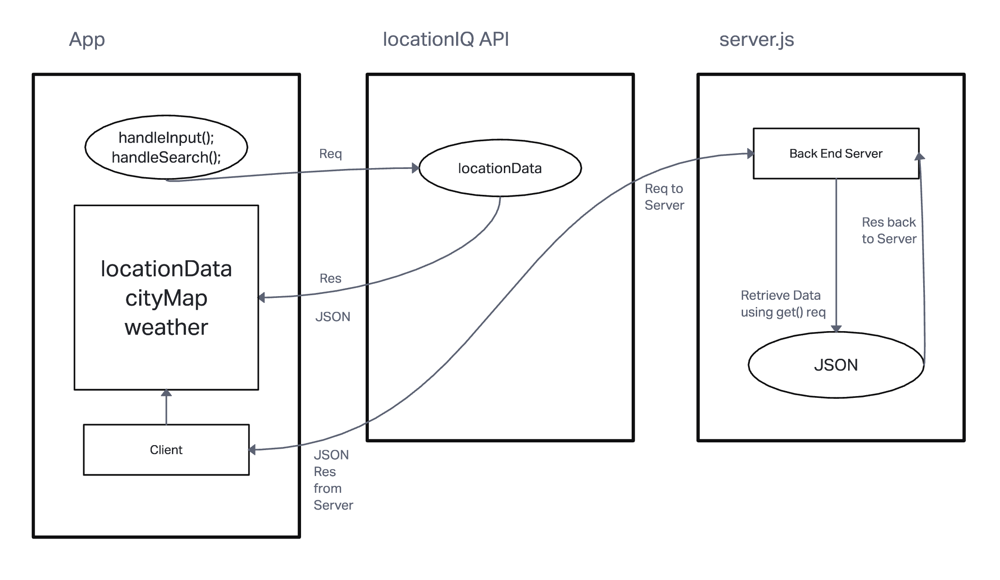

## Process

# city-explorer-api

**Author**: Diego Sousa
**Version**: 1.0.0 

## Overview

This application is a city explorer that allows users to search for a location and see the weather, movies, and yelp reviews for that location.

## Getting Started
<!-- What are the steps that a user must take in order to build this app on their own machine and get it running? -->

1. Clone the repository
2. Install dependencies

## Architecture
<!-- Provide a detailed description of the application design. What technologies (languages, libraries, etc) you're using, and any other relevant design information. -->

This application is built using Express, dotenv, cors and nodemon.

## Change Log

## Credit and Collaborations

## Time Estimates

Name of feature: Set up repository & backend.

Estimate of time needed to complete: 20 minutes

Start time: 5:00pm EST

Finish time: 5:30pm EST

Actual time needed to complete: 30 minutes

===========================================================================

Name of feature: Weather info for the city

Estimate of time needed to complete: 1 hour

Start time: 5:30pm EST

Finish time: 7:30pm EST

Actual time needed to complete: 2 hours

===========================================================================

Name of feature: Set up Error messages.

Estimate of time needed to complete: 20 minutes

Start time: 8:30pm EST

Finish time: 9:00pm EST

Actual time needed to complete: 30 minutes

===========================================================================

Name of feature: Weather (live).

Estimate of time needed to complete: 20 minutes

Start time: 5:30pm EST

Finish time: 6:00pm EST

Actual time needed to complete: 30 minutes

===========================================================================

Name of feature: Movies.

Estimate of time needed to complete: 1 hour

Start time: 6:00pm EST

Finish time: 7:00pm EST

Actual time needed to complete: 1 hour

===========================================================================

Name of feature: Refactor modularize.

Estimate of time needed to complete: 30 minutes

Start time: 5:00pm EST

Finish time: 5:20pm EST

Actual time needed to complete: 20 minutes

===========================================================================